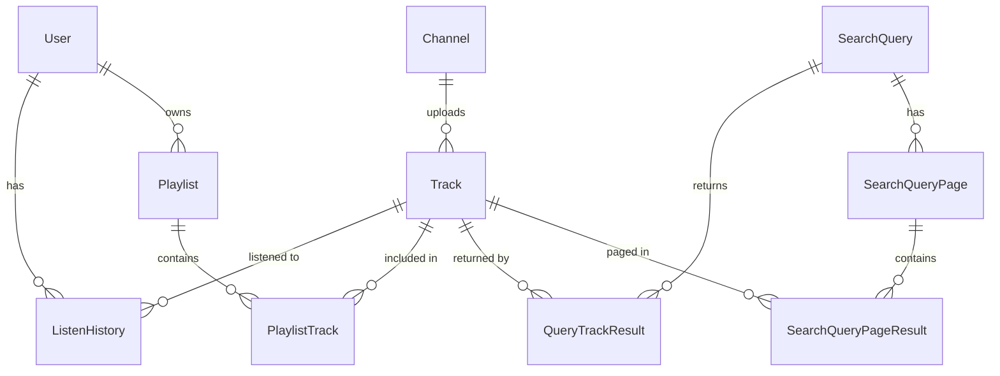

# AudioScape Database Schema — Phase 2 (Revised)

Merges the original core-application schema with the YouTube ingestion/search-caching schema into one coherent, non-redundant model. Two domains share a single spine (`tracks`) instead of duplicating track data across a JSON cache and a relational table.

---

## Design Principles

- **One source of truth per entity.** The earlier draft stored track data twice — once in `tracks`, once as JSON blobs inside `related_tracks_cache`. That's removed: everything now points back to `tracks`, so a title correction or availability flag update is visible everywhere automatically instead of needing cache invalidation in N places.
- **Natural keys where YouTube already guarantees uniqueness** (`youtube_video_id`, YouTube channel ID). Avoids a UUID indirection layer for data that's looked up by YouTube ID on almost every write path.
- **UUIDs everywhere else**, per project default.
- **No premature normalization.** `genre`/`tags` stay as arrays on `tracks` rather than their own dimension tables — a `genres` table only earns its keep once you need faceted counts or genre browse pages; not the case yet.
- **No append-only event log yet.** `listen_history` stays an upsert model (bounded by unique user×track pairs, not total plays). If detailed per-play analytics (skip rate, session, device) become a real requirement, that's the trigger to add a separate `listening_events` table — not before.

---

## Entity Relationship Diagram



---

## Domain A — Core Application
`users` · `playlists` · `playlist_tracks` · `listen_history`

## Domain B — YouTube Data & Search Pipeline
`channels` · `tracks` · `search_queries` · `query_track_results` · `search_query_pages` · `search_query_page_results` · `api_quota_usage`

`tracks` is the bridge: Domain A reads from it (what a user played/saved), Domain B writes to it (what YouTube ingestion discovers).

---

## Prisma Schema

```prisma
generator client {
  provider        = "prisma-client-js"
  previewFeatures = ["postgresqlExtensions"]
}

datasource db {
  provider   = "postgresql"
  url        = env("DATABASE_URL")
  extensions = [pg_trgm, unaccent]
}

// ════════════════════════════════════════════════════════════
// DOMAIN A — CORE APPLICATION
// ════════════════════════════════════════════════════════════

model User {
  id          String    @id @default(uuid())
  authId      String    @unique @map("auth_id")
  email       String?   @unique
  displayName String?   @map("display_name")
  photoUrl    String?   @map("photo_url")
  lastLoginAt DateTime? @map("last_login_at")
  createdAt   DateTime  @default(now()) @map("created_at")
  updatedAt   DateTime  @updatedAt @map("updated_at")

  listenHistory ListenHistory[]
  playlists     Playlist[]

  @@map("users")
}

model ListenHistory {
  id            String         @id @default(uuid())
  userId        String         @map("user_id")
  trackId       String         @map("track_id")
  playCount     Int            @default(1) @map("play_count")
  liked         Boolean        @default(false)
  likedAt       DateTime?      @map("liked_at")
  source        PlaybackSource @default(SEARCH)
  firstPlayedAt DateTime       @default(now()) @map("first_played_at")
  lastPlayedAt  DateTime       @default(now()) @map("last_played_at")
  createdAt     DateTime       @default(now()) @map("created_at")

  user  User   @relation(fields: [userId], references: [id], onDelete: Cascade)
  track Tracks @relation(fields: [trackId], references: [youtubeVideoId], onDelete: Cascade)

  @@unique([userId, trackId])
  @@index([userId, lastPlayedAt(sort: Desc)])
  @@index([trackId])
  @@map("listen_history")
}

model Playlist {
  id        String   @id @default(uuid())
  userId    String   @map("user_id")
  name      String
  createdAt DateTime @default(now()) @map("created_at")
  updatedAt DateTime @updatedAt @map("updated_at")

  user   User            @relation(fields: [userId], references: [id], onDelete: Cascade)
  tracks PlaylistTrack[]

  @@unique([userId, name])
  @@map("playlists")
}

model PlaylistTrack {
  id         String   @id @default(uuid())
  playlistId String   @map("playlist_id")
  trackId    String   @map("track_id")
  position   Int
  addedAt    DateTime @default(now()) @map("added_at")

  playlist Playlist @relation(fields: [playlistId], references: [id], onDelete: Cascade)
  track    Tracks   @relation(fields: [trackId], references: [youtubeVideoId], onDelete: Cascade)

  @@unique([playlistId, trackId])
  @@index([playlistId, position])
  @@map("playlist_tracks")
}

// ════════════════════════════════════════════════════════════
// DOMAIN B — YOUTUBE DATA & SEARCH PIPELINE
// ════════════════════════════════════════════════════════════

model Channel {
  id              String   @id                     // YouTube channel ID (natural key)
  title           String
  thumbnailUrl    String?  @map("thumbnail_url")
  subscriberCount BigInt?  @map("subscriber_count")
  lastFetchedAt   DateTime @default(now()) @map("last_fetched_at")
  createdAt       DateTime @default(now()) @map("created_at")
  updatedAt       DateTime @updatedAt @map("updated_at")

  tracks Tracks[]

  @@map("channels")
}

model Tracks {
  youtubeVideoId  String    @id @map("youtube_video_id")   // natural key
  title           String
  artist          String?                                  // artist name string from history/playlists/cache
  channelId       String?   @map("channel_id")
  description     String?
  thumbnailUrl    String?   @map("thumbnail_url")
  duration        String?                                   // raw ISO 8601, e.g. "PT3M45S"
  durationSeconds Int?      @map("duration_seconds")
  tags            String[]  @default([])                    // raw YouTube tags — search/matching only
  genre           String[]  @default([])                    // curated keywords — feeds recommend.js TF-IDF
  categoryId      String?   @map("category_id")
  publishedAt     DateTime? @map("published_at")
  viewCount       BigInt?   @map("view_count")
  likeCount       BigInt?   @map("like_count")

  searchVector Unsupported("tsvector")? @map("search_vector") // maintained via trigger

  // Data Analysis & Content Quality Fields
  topicCategories String[]  @default([]) @map("topic_categories")
  contentTags     String[]  @default([]) @map("content_tags")
  rawTitle        String?   @map("raw_title")
  artistName      String?   @map("artist_name")
  qualityScore    Float?    @map("quality_score")
  isEmbeddable    Boolean   @default(true)  @map("is_embeddable")
  licensedContent Boolean   @default(false) @map("licensed_content")

  source        TrackSource @default(SEARCH)
  isAvailable   Boolean     @default(true) @map("is_available")
  lastFetchedAt DateTime    @default(now()) @map("last_fetched_at")
  fetchCount    Int         @default(1) @map("fetch_count")

  createdAt DateTime @default(now()) @map("created_at")
  updatedAt DateTime @updatedAt @map("updated_at")

  channel        Channel?           @relation(fields: [channelId], references: [id], onDelete: SetNull)
  listenHistory  ListenHistory[]
  playlistTracks PlaylistTrack[]
  queryResults   QueryTrackResult[]
  pageResults    SearchQueryPageResult[]

  @@index([channelId])
  @@index([lastFetchedAt])
  @@index([searchVector], type: Gin)
  @@map("tracks")
}

model SearchQuery {
  id                 String    @id @default(uuid())
  normalizedQuery    String    @unique @map("normalized_query")
  rawQuery           String    @map("raw_query")
  queryType          QueryType @default(USER_SEARCH) @map("query_type")
  hitCount           Int       @default(1) @map("hit_count")
  resultCount        Int?      @map("result_count")
  lastYoutubeFetchAt DateTime? @map("last_youtube_fetch_at")
  lastSearchedAt     DateTime  @default(now()) @map("last_searched_at")
  expiresAt          DateTime? @map("expires_at")
  createdAt          DateTime  @default(now()) @map("created_at")

  results QueryTrackResult[]
  pages   SearchQueryPage[]

  @@index([expiresAt])
  @@map("search_queries")
}

model SearchQueryPage {
  id            String                  @id @default(uuid())
  queryId       String                  @map("query_id")
  pageToken     String?                 @map("page_token")          // null for page 0
  nextPageToken String?                 @map("next_page_token")
  pageIndex     Int                     @default(0) @map("page_index")
  createdAt     DateTime                @default(now()) @map("created_at")

  query         SearchQuery             @relation(fields: [queryId], references: [id], onDelete: Cascade)
  results       SearchQueryPageResult[]

  @@unique([queryId, pageToken])
  @@map("search_query_pages")
}

model SearchQueryPageResult {
  id           String          @id @default(uuid())
  pageId       String          @map("page_id")
  trackId      String          @map("track_id")
  rankPosition Int             @map("rank_position")             // preserves page-specific YouTube rank order
  createdAt    DateTime        @default(now()) @map("created_at")

  page         SearchQueryPage @relation(fields: [pageId], references: [id], onDelete: Cascade)
  track        Tracks          @relation(fields: [trackId], references: [youtubeVideoId], onDelete: Cascade)

  @@unique([pageId, trackId])
  @@index([trackId])
  @@map("search_query_page_results")
}

model QueryTrackResult {
  id           String   @id @default(uuid())
  queryId      String   @map("query_id")
  trackId      String   @map("track_id")
  rankPosition Int      @map("rank_position")             // preserves original YouTube result order
  createdAt    DateTime @default(now()) @map("created_at")

  query SearchQuery @relation(fields: [queryId], references: [id], onDelete: Cascade)
  track Tracks      @relation(fields: [trackId], references: [youtubeVideoId], onDelete: Cascade)

  @@unique([queryId, trackId])
  @@index([trackId])
  @@map("query_track_results")
}

model ApiQuotaUsage {
  id            String      @id @default(uuid())
  date          DateTime    @db.Date
  endpoint      ApiEndpoint
  apiKeyId      String      @default("A") @map("api_key_id")
  unitsConsumed Int         @default(0) @map("units_consumed")
  callCount     Int         @default(0) @map("call_count")
  updatedAt     DateTime    @updatedAt @map("updated_at")

  @@unique([date, endpoint, apiKeyId])
  @@map("api_quota_usage")
}

// ════════════════════════════════════════════════════════════
// ENUMS
// ════════════════════════════════════════════════════════════

enum PlaybackSource {
  SEARCH
  EXPLORE
  RECOMMENDATION
  PLAYLIST
  RELATED_QUEUE
}

enum TrackSource {
  SEARCH
  RELATED_CACHE
  RECOMMENDATION_BACKFILL
  MANUAL
}

enum QueryType {
  USER_SEARCH
  CURATED_KEYWORD
  RECOMMENDATION
}

enum ApiEndpoint {
  SEARCH_LIST
  VIDEOS_LIST
  VIDEO_CATEGORIES_LIST
}
```

---

## Supplementary SQL (not expressible in Prisma schema)

Add as a raw migration (`prisma migrate dev --create-only`, then paste in):

```sql
CREATE EXTENSION IF NOT EXISTS pg_trgm;
CREATE EXTENSION IF NOT EXISTS unaccent;

-- Fuzzy/typo-tolerant matching
CREATE INDEX idx_tracks_title_trgm   ON tracks   USING GIN (title gin_trgm_ops);
CREATE INDEX idx_channels_title_trgm ON channels USING GIN (title gin_trgm_ops);

-- Auto-maintained full-text search vector
CREATE FUNCTION tracks_search_vector_trigger() RETURNS trigger AS $$
begin
  new.search_vector :=
    setweight(to_tsvector('english', coalesce(new.title, '')), 'A') ||
    setweight(to_tsvector('english', coalesce(array_to_string(new.tags, ' '), '')), 'B') ||
    setweight(to_tsvector('english', coalesce(array_to_string(new.genre, ' '), '')), 'B') ||
    setweight(to_tsvector('english', coalesce(new.description, '')), 'C');
  return new;
end
$$ LANGUAGE plpgsql;

CREATE TRIGGER tsvectorupdate
BEFORE INSERT OR UPDATE ON tracks
FOR EACH ROW EXECUTE FUNCTION tracks_search_vector_trigger();

-- Integrity constraints Prisma's DSL can't express
ALTER TABLE tracks           ADD CONSTRAINT chk_duration_nonneg   CHECK (duration_seconds IS NULL OR duration_seconds >= 0);
ALTER TABLE tracks           ADD CONSTRAINT chk_view_count_nonneg CHECK (view_count IS NULL OR view_count >= 0);
ALTER TABLE listen_history   ADD CONSTRAINT chk_play_count_min    CHECK (play_count >= 1);
ALTER TABLE playlist_tracks  ADD CONSTRAINT chk_position_nonneg   CHECK (position >= 0);
ALTER TABLE api_quota_usage  ADD CONSTRAINT chk_units_nonneg      CHECK (units_consumed >= 0);
```

Note: `Unsupported("tsvector")` fields aren't exposed on the typed Prisma client — reads/writes to `search_vector` happen via `$queryRaw`, which is fine since it's trigger-maintained and only ever queried, never written directly by app code.

---

## Key Design Decisions (deltas from the original draft)

| Change | Why | Trade-off |
|---|---|---|
| **`channels` extracted from `tracks`** | Channel title/thumbnail/subscriber count are independent of any one track and change on their own schedule; normalizing avoids N duplicate copies and enables "all tracks by this artist" queries and future artist pages. | One extra join when rendering a track with artist info — mitigated by the FK index; negligible at this scale. |
| **`related_tracks_cache` (JSON) → `search_queries` + `query_track_results`** | Same underlying concept as the quota-cache `search_queries` table (a keyword maps to a set of tracks with a TTL) — no reason to maintain two systems. Rows now reference real `tracks`, so a stale/unavailable video is reflected everywhere instantly instead of living on in a frozen JSON snapshot. | Slightly more joins to rebuild an explore-feed section vs. parsing one JSON blob. Worth it: correctness > micro-optimization at this scale. |
| **`playlist_tracks.position` added** | Firestore's array field preserved song order implicitly; a Postgres junction table has no inherent order without an explicit column. This was a gap in the original draft that would have silently lost playlist ordering on migration. | None — this is a correctness fix, not a trade-off. |
| **`tracks.tags` vs `tracks.genre` split** | `tags` = raw, noisy YouTube data (good for search recall). `genre` = curated keywords specifically feeding the existing TF-IDF recommender (`recommend.js`). Conflating them would pollute recommendation input with search noise. | One more array column; cheap. |
| **`source` on `tracks` and `listen_history`** | Lightweight lineage: how a track entered the catalog (search / related-cache backfill / recommendation backfill / manual) and how a user encountered a play (search / explore / recommendation / playlist). Useful for diagnosing quota spend and for future recommendation feature engineering, without standing up a full audit-log table. | Two enum columns; no meaningful cost. |
| **`api_quota_usage` added** | Required to implement the daily-quota guardrail from the caching design — without it there's no way to know usage trends or halt live `search.list` calls before hitting the cap. | One row per (day, endpoint); trivial storage. |
| **`listen_history` stays upsert, not append-only** | Row count bounded by unique (user, track) pairs, not total plays — scales fine indefinitely. `firstPlayedAt`/`likedAt` added for slightly richer recency signal without going to full event-log complexity. | Loses per-play session/device detail. Fine until a real ML feature-engineering need shows up — add a separate `listening_events` table then, not preemptively. |

---

## Firestore → Postgres Field Mapping

| Firestore Path | Postgres Table(s) | Notes |
|---|---|---|
| `users/{uid}` | `users` | `google_sub` = Google OAuth ID token `sub` claim |
| `users/{uid}/music_history/{docId}` | `tracks`, `channels`, `listen_history` | Track/channel metadata extracted into their own tables; per-user stats in `listen_history` |
| `users/{uid}/playlists/{docId}` | `playlists`, `playlist_tracks` | `songs[]` array → junction rows with explicit `position` |
| `relatedTracksCache/{keyword}` | `search_queries` (`query_type = CURATED_KEYWORD`), `query_track_results` | JSON blob replaced by FK rows into `tracks` |
| *(new — no Firestore equivalent)* | `api_quota_usage` | Introduced for quota-guardrail tracking |

---

## Implementation Complexity & Scale Notes

- **Complexity: Medium.** Core Prisma migration is standard; the only manual step is the one supplementary SQL migration for extensions/trigger/constraints (same shape as the original `music_videos` design — nothing new in kind).
- **Indexes chosen to match actual query patterns already in the codebase**: search bar (`search_vector` GIN + trigram), recently played (`listen_history` composite index on `userId, lastPlayedAt`), explore feed (`search_queries.expiresAt` for TTL sweeps), refresh jobs (`tracks.lastFetchedAt`).
- **No partitioning needed yet.** `listen_history` and `tracks` stay single-table at this scale; revisit table partitioning by date only if `tracks` crosses low millions of rows or `api_quota_usage` needs multi-year retention (unlikely — that table alone stays under a few thousand rows/year).

## Future Considerations (not implemented now)

- Normalized `genres` table if faceted browse/genre pages are built later.
- Soft-delete (`deleted_at`) on `users`/`playlists` if GDPR-style retention requirements appear.
- Append-only `listening_events` table if session/device-level play analytics become a product requirement.