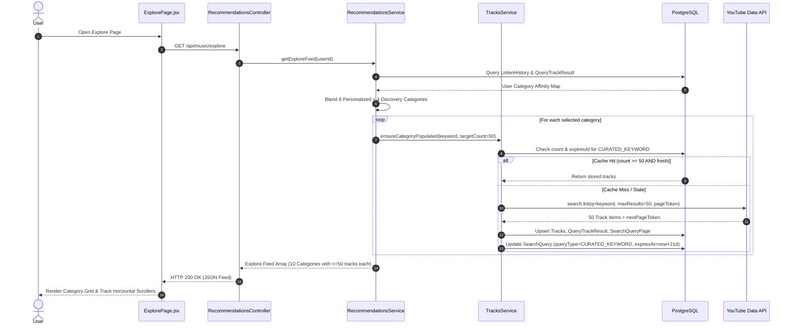

# Explore Page V2 — DB-First, Personalized Discovery Architecture

> **Module:** Explore Feed (`ExplorePage.jsx` + `RecommendationsModule` + `TracksModule`)  
> **Status:** 🔮 Architectural Specification (Companion to `plan/step3.7_recommendations_module.md`)  
> **Goal:** Deepen per-category track pools (≈50 tracks), deliver meaningful zero-cost personalization, establish a single category source of truth, and move YouTube API quota spend onto background pre-warming routines.

---

## 1. Executive Summary & Problem Map

The existing Explore Page relies on live YouTube searches capped at 10 results per query, hardcodes different category lists across frontend and backend components, treats immutable genre searches like ephemeral user queries, and recomputes basic user interest signals on every request without persistence or caching.

Explore V2 transforms the feed from a **"Live YouTube Proxy"** into a **"Database-First, Pre-Warmed Content Hub"**.

### Quick Comparison Matrix

| Problem Area | Current State (V1) | Redesigned State (V2) | Architectural Benefit |
|---|---|---|---|
| **Track Depth** | Hardcoded `maxResults=10`. "Load More" exhausts immediately. | `maxResults=50` + `SearchQueryPage` resume tokens. | 5x more tracks per API call (50 vs 10) at identical quota cost (100 units). |
| **Cache Freshness & TTL** | Ephemeral 24-hour TTL for all searches via `USER_SEARCH`. | Differentiated TTL: 24h for ad-hoc user searches, **21 days** for `CURATED_KEYWORD`. | Quota spend drops drastically; evergreen categories (e.g. "Lofi", "Pop") stay cached. |
| **Category Taxonomy** | 3 divergent lists in `curated-genres.ts`, `ExplorePage.jsx`, and design docs. | Single endpoint `GET /api/music/categories` backed by unified `CURATED_CATEGORIES`. | Eliminates taxonomy drift; frontend & backend stay perfectly aligned. |
| **Personalization** | Genre frequencies recomputed live per request; used only to pick search terms. | Relational affinity scoring (`ListenHistory` ➔ `QueryTrackResult`) with a 60/40 exploit/explore split. | Smart, zero-overhead personalization cached for 1 hour per user. |
| **API Quota Execution** | Live on request path. User waits for YouTube response. | Scheduled background pre-warming (`refreshExploreCache()`); lazy call is fallback only. | Zero-latency Explore feed loads; API quota consumed predictable off-peak hours. |
| **UI Components** | Redundant Filter Pills and Category Grid competing for state. | Single Category Grid UI driven by backend category metadata. | Cleaner code, lower maintenance, consistent UX. |

---

## 2. Deep-Dive: The TTL (Time-To-Live) Concept

### 2.1 What is TTL?
**Time-To-Live (TTL)** is a caching mechanism that determines how long a piece of data remains valid before it expires and must be refreshed or re-fetched from the primary source (in our case, YouTube API). 

In database models, TTL is typically stored as an `expiresAt` timestamp (`expiresAt = currentTime + TTL_Duration`).

### 2.2 Why TTL is Used in Explore V2
In V1, every search result stored in PostgreSQL received a flat **24-hour expiration (`expiresAt = now() + 24h`)**. It failed to differentiate between *ephemeral user searches* and *curated discovery categories*.

1. **User Ad-hoc Search (Ephemeral):** A query like `"taylor swift live concert raw audio sub 2024"` is highly specific. A 24-hour TTL (`USER_SEARCH`) makes sense because user search trends and fresh videos shift quickly.
2. **Curated Explore Genre (Evergreen):** A category like `"lofi music"`, `"jazz classics"`, or `"synthwave"` does **not** change significantly from day to day. 50 great Lofi tracks today will still be great Lofi tracks 3 weeks from now.

Treating curated categories as 24-hour ephemeral queries forced AudioScape to repeatedly re-fetch the same genre keywords every single day, burning thousands of YouTube API quota units unnecessarily.

### 2.3 How Differentiated TTL Helps
Explore V2 introduces **Query-Type Scoped Expiration**:

$$\text{TTL}(\text{query}) = \begin{cases} 24 \text{ hours} & \text{if } \text{queryType} = \text{USER\_SEARCH} \\ 21 \text{ days} & \text{if } \text{queryType} = \text{CURATED\_KEYWORD} \end{cases}$$

```
V1 Cache Lifecycle (Flat 24h TTL):
Ingest "lofi music" ──► Expire (24h) ──► Re-fetch (Cost: 100 quota units/day)

V2 Cache Lifecycle (21-Day TTL for Curated Keywords):
Ingest "lofi music" ──► Valid for 21 Days ──► Re-warm in background (Cost: 100 quota units / 21 days)
```

#### Key Benefits of 21-Day TTL:
* **95% Reduction in Category Quota Spend:** Re-fetching a category once every 21 days instead of every 24 hours reduces quota expenditure for category caching by ~95%.
* **Elimination of Cache Trashing:** Popular categories stay in PostgreSQL, providing instant response times ($<10\text{ms}$) for every user opening the Explore feed.
* **Predictable Background Maintenance:** Enables scheduled cron jobs to refresh categories systematically during off-peak hours rather than triggering sudden YouTube quota spikes during high user traffic.

---

## 3. Key Architectural Pillars

```
                     ┌─────────────────────────────────────────────────────────┐
                     │                     FRONTEND (React)                    │
                     │                     ExplorePage.jsx                     │
                     └──────────────────────────┬──────────────────────────────┘
                                                │
                                       GET /api/music/explore
                                                │
                                                ▼
┌──────────────────────────────────────────────────────────────────────────────────────────────┐
│                                  BACKEND (NestJS API Layer)                                  │
│                                   RecommendationsService                                     │
├───────────────────────────────────────────────┬──────────────────────────────────────────────┤
│  1. Category Affinity Ranking                 │  2. DB-First Catalog Ingestion               │
│  ┌─────────────────────────────────────────┐  │  ┌────────────────────────────────────────┐  │
│  │ User History ➔ ListenHistory            │  │  │ Check PostgreSQL (QueryTrackResult)    │  │
│  │ Join QueryTrackResult                   │  │  │ Count >= 50 && Fresh? ──► Return DB   │  │
│  │ Compute Taste Weights (60% Personal)    │  │  │ Stale or Thin? ──► Ingest YouTube     │  │
│  │ Global Popularity Blend (40% Explore)   │  │  │ Write to Pages + 21-Day TTL           │  │
│  └─────────────────────────────────────────┘  │  └────────────────────────────────────────┘  │
└───────────────────────────────────────────────┴──────────────────────────────────────────────┘
                                                │
                                                ▼
┌──────────────────────────────────────────────────────────────────────────────────────────────┐
│                                    PERSISTENCE (PostgreSQL)                                  │
│  ┌───────────────────────────┐ ┌───────────────────────────┐ ┌────────────────────────────┐  │
│  │ SearchQuery               │ │ SearchQueryPage           │ │ SearchQueryPageResult      │  │
│  │ (queryType, expiresAt=21d)│ │ (pageToken, nextToken)    │ │ (rankPosition, trackId)    │  │
│  └───────────────────────────┘ └───────────────────────────┘ └────────────────────────────┘  │
└──────────────────────────────────────────────────────────────────────────────────────────────┘
```

### Pillar 1: Schema-Backed Resumable Backfilling (`SearchQueryPage`)
To support pagination beyond page 0 without re-fetching existing tracks or duplicating YouTube API expenditure, the database includes explicit page token tracking tables:

```prisma
model SearchQueryPage {
  id            String                  @id @default(uuid())
  queryId       String                  @map("query_id")
  pageToken     String?                 @map("page_token")       // null = page 0
  nextPageToken String?                 @map("next_page_token")
  pageIndex     Int                     @default(0) @map("page_index")
  createdAt     DateTime                @default(now()) @map("created_at")

  query         SearchQuery             @relation(fields: [queryId], references: [id], onDelete: Cascade)
  results       SearchQueryPageResult[]

  @@unique([queryId, pageToken])
  @@map("search_query_pages")
}

model SearchQueryPageResult {
  id           String          @id @default(uuid())
  pageId       String          @map("page_id")
  trackId      String          @map("track_id")
  rankPosition Int             @map("rank_position")
  createdAt    DateTime        @default(now()) @map("created_at")

  page         SearchQueryPage @relation(fields: [pageId], references: [id], onDelete: Cascade)
  track        Tracks          @relation(fields: [trackId], references: [youtubeVideoId], onDelete: Cascade)

  @@unique([pageId, trackId])
  @@index([trackId])
  @@map("search_query_page_results")
}
```

* **`ensureCategoryPopulated()` Algorithm:**
  1. Requests `maxResults=50` from YouTube (100 quota units).
  2. If count $< 50$, checks `SearchQueryPage` for the latest `nextPageToken`.
  3. Resumes fetching from `nextPageToken` up to `maxPages=3` (bounding maximum quota spend to 300 units per category).
  4. Upserts tracks into `Tracks`, flattens read models in `QueryTrackResult`, and logs provenance in `SearchQueryPageResult`.
  5. Sets `queryType = 'CURATED_KEYWORD'` and `expiresAt = now + 21 days`.

---

### Pillar 2: Single Category Source of Truth
Instead of maintaining separate category arrays in frontend components, the backend owns the authoritative category taxonomy:

```typescript
// backend/src/recommendations/curated-genres.ts
export interface CuratedCategory {
  slug: string;           // e.g. "lofi-chill"
  keyword: string;        // e.g. "lofi music"
  label: string;          // e.g. "Lofi & Chill"
  icon: string;           // Lucide icon identifier ("Headphones")
  gradient: [string, string]; // Tailwind gradient colors ["from-purple-700", "to-blue-600"]
}
```

* **Endpoint:** `GET /api/music/categories`
* **Frontend Integration:** `ExploreCategoryGrid.jsx` fetches category configurations dynamically from this endpoint. Hardcoded local genre definitions in `ExplorePage.jsx` are removed.

---

### Pillar 3: Zero-Overhead Relational Personalization
Personalization does not require complex ML models. Because tracks played from curated categories are linked relationally via `ListenHistory ➔ Tracks ➔ QueryTrackResult ➔ SearchQuery`, user affinity to each category is computed directly from SQL history:

1. **Taste Weighting:** Uses `calculateTasteWeight(historyItem)` from `taste-weight.util.ts` (combines play count, recency decay, and liked status).
2. **Exploit / Explore Blend Ratio:**
   * **6 Personalized Categories (60% Exploit):** Top categories sorted by user affinity score.
   * **4 Discovery Categories (40% Explore):** Unexplored categories with high global `hitCount`.
   * **Cold Start Fallback:** If the user has $<3$ plays, serve 10 randomly shuffled curated categories.
3. **In-Memory Caching:** Category affinity rankings are cached per user in memory for 1 hour (`Map<userId, { ranking, expiresAt }>`) and invalidated automatically when new listen events occur.

---

### Pillar 4: Background Pre-Warming Routine
Explore requests should never stall waiting for YouTube API responses. 

* **Cron Endpoint:** `GET /internal/cron/refresh-explore-cache`
* **Execution Strategy:**
  * Runs on a schedule (e.g. via `@nestjs/schedule` or platform cron).
  * Iterates over top 20 popular categories plus core baseline genres.
  * Calls `ensureCategoryPopulated(keyword, 50)` in the background.
* **Quota Expenditure:** ~3,000 quota units per run (well within the daily budget limit of 16,000 units across dual API keys).
* **Lazy Fallback Safety Net:** If a user requests an un-cached category, `GET /api/music/explore` triggers `ensureCategoryPopulated()` inline as a fallback.

---

## 4. End-to-End Execution Flow



---

## 5. Phased Rollout Plan

```
┌──────────────────────────────────────────────────────────────────────────────────┐
│ PHASE 1: Data Model & Ingestion Fixes                                            │
│ • Execute Prisma Migration for SearchQueryPage & SearchQueryPageResult           │
│ • Update search.list maxResults to 50 in tracks.service.ts                       │
│ • Implement ensureCategoryPopulated() with 21-day TTL for CURATED_KEYWORD        │
└─────────────────────────┬────────────────────────────────────────────────────────┘
                          │
                          ▼
┌──────────────────────────────────────────────────────────────────────────────────┐
│ PHASE 2: Backend Personalization Layer                                           │
│ • Implement taste-weight.util.ts                                                 │
│ • Build getCategoryAffinity() in recommendations.service.ts                      │
│ • Implement 60/40 Exploit/Explore category ranking with 1-hour user cache        │
└─────────────────────────┬────────────────────────────────────────────────────────┘
                          │
                          ▼
┌──────────────────────────────────────────────────────────────────────────────────┐
│ PHASE 3: Single Source of Truth Category API                                     │
│ • Create GET /api/music/categories endpoint with full CuratedCategory metadata   │
│ • Update ExploreCategoryGrid.jsx to consume API category metadata                 │
│ • Remove hardcoded genre arrays from ExplorePage.jsx                              │
└─────────────────────────┬────────────────────────────────────────────────────────┘
                          │
                          ▼
┌──────────────────────────────────────────────────────────────────────────────────┐
│ PHASE 4: UI Cleanup & Redundancy Removal                                         │
│ • Remove legacy ExploreFilterPills.jsx                                           │
│ • Clean up client-side keyword state synchronization                             │
└─────────────────────────┬────────────────────────────────────────────────────────┘
                          │
                          ▼
┌──────────────────────────────────────────────────────────────────────────────────┐
│ PHASE 5: Background Pre-Warming Cron                                             │
│ • Implement refreshExploreCache() background job via @nestjs/schedule           │
│ • Verify daily YouTube API quota consumption stays under 3,000 units             │
└──────────────────────────────────────────────────────────────────────────────────┘
```

---

## 6. Summary of Architectural Wins

1. **Zero-Latency User Experience:** Standard Explore page requests are satisfied 100% from PostgreSQL in $<20\text{ms}$.
2. **Quota Efficiency:** Up to 95% reduction in category search quota spend due to 21-day TTLs and 50-item page fetching.
3. **True Personalization:** Feed dynamically adapts to user listening patterns without introducing machine learning operational complexity.
4. **Single Source of Truth:** Guaranteed alignment between backend curation and frontend visual UI rendering.
