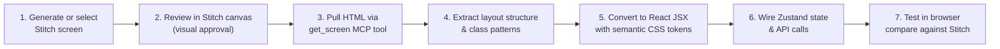

# AudioScape Frontend Revamp Plan

> **Stitch Project:** `11671303142545710490` — AudioScape Design System  
> **Dark Theme:** Midnight Studio (`assets/5ee7204555234b6e9a9acb5ea3347d43`)  
> **Light Theme:** Aura Lumina (`assets/c496552a6dbd4ceea5373534a85fc9b9`)  
> **Frontend Stack:** React 19 + Vite + Tailwind CSS v4 + Zustand  

---

## Overview

This plan breaks the frontend revamp into **7 sequential steps**. Each step specifies:
- **What** needs to change
- **Which Stitch screens** to reference (and how to pull them)
- **Which files** to create, modify, or delete
- **Dependencies** on prior steps

> [!IMPORTANT]
> **Rule**: No existing Stitch screens will be deleted. All new screens are appended.  
> **Rule**: Green (`#22c55e`) is prohibited everywhere. The palette is Purple / Pink / Blue / Black / White only.

### Scope Boundary

> [!NOTE]
> This is a **frontend visual + structural** revamp only. The following are explicitly **out of scope** unless a step says otherwise:
> - Backend routes, controllers, or Firestore schema (`backend/`)
> - The `getBackendURL()` local-vs-prod fallback logic — assumed to keep working as-is
> - YouTube Data API quota/rate-limit behavior (mentioned in `HelpFeedback.jsx` FAQ) — not being changed
> - Recommendation algorithm (`recommend.js`, TF-IDF logic) — not being touched
>
> If a step's rebuild surfaces a need to change backend contracts (e.g., History page needs a new endpoint), flag it explicitly in that step rather than silently expanding scope.

---

## Current State Audit

### File Inventory

```
frontend/
├── App.jsx                          # Routing + persistent player + playlist modal
├── ThemeProvider.jsx                 # Theme toggle via classList (dark/light)
├── ResponsiveLayout.jsx             # Max-width wrapper (unused potential)
├── index.css                        # Tailwind v4 + shadcn/ui HSL variables
├── main.jsx                         # React DOM entry
│
├── pages/
│   ├── LandingPage.jsx              # Public marketing/login page
│   ├── Home.jsx                     # Dashboard (uses AppLayout)
│   ├── ExplorePage.jsx              # YouTube search (duplicates layout)
│   ├── FavoritesPage.jsx            # Liked tracks (duplicates layout)
│   ├── PlaylistsPage.jsx            # Playlist CRUD (duplicates layout)
│   ├── HelpFeedback.jsx             # Help & feedback form
│   └── NotFound.jsx                 # 404 page
│
├── components/
│   ├── Auth/UserMenu.jsx            # Avatar dropdown, logout, profile
│   ├── Cards/MusicCard.jsx          # Track card (thumbnail + play overlay)
│   ├── Home/
│   │   ├── Sidebar.jsx              # Nav sidebar
│   │   ├── SearchBar.jsx            # YouTube search input + results dropdown
│   │   ├── HeroSection.jsx          # Welcome banner
│   │   ├── RecommendForYou.jsx      # TF-IDF recommendation grid
│   │   ├── RecentlyPlayed.jsx       # History horizontal scroll
│   │   ├── Footer.jsx               # Page footer
│   │   ├── Loader.jsx               # Full-screen loading overlay
│   │   └── Loader2.jsx              # Alternate loader
│   ├── Layout/AppLayout.jsx         # Shared shell (sidebar + navbar + children)
│   ├── Player/
│   │   ├── PlayerContainer.jsx      # Player mode orchestrator (mini/full)
│   │   ├── MiniPlayer.jsx           # Draggable floating mini player
│   │   ├── FullScreenPlayer.jsx     # Expanded player view
│   │   ├── MusicPlayer.jsx          # ⚠️ DEAD — references missing store actions
│   │   ├── PlayerControls.jsx       # Play/Pause/Skip/Shuffle buttons
│   │   ├── ProgressBar.jsx          # Track seeker slider
│   │   ├── VolumeBar.jsx            # Volume control slider
│   │   ├── TrackQueue.jsx           # Up-next queue list
│   │   └── YoutubePlayer.jsx        # Hidden YT iframe embed
│   └── Playlist/PlaylistModal.jsx   # Add-to-playlist modal
│
├── store/
│   ├── usePlayerStore.js            # Zustand: track, queue, playback state
│   └── usePlaylistStore.js          # Zustand: playlist modal open/close
│
├── context/AuthContext              # Firebase auth provider
├── firebase/                        # Firebase config
└── utils/                           # YouTube API helpers, formatters
```

### Key Problems to Fix

| # | Problem | Impact |
|---|---------|--------|
| 1 | **Layout duplication** — `ExplorePage`, `FavoritesPage`, `PlaylistsPage` each re-implement sidebar + navbar instead of using `AppLayout` | Inconsistent behavior, doubled maintenance |
| 2 | **CSS variables are generic shadcn/ui HSL tokens** — No connection to the Stitch design system tokens (purple/pink/blue palette) | Theme looks nothing like the Stitch designs |
| 3 | **Hardcoded colors everywhere** — Components use inline `bg-slate-900`, `bg-gray-100`, `dark:bg-gray-700` instead of semantic tokens | Theme switching is brittle, colors don't match brand |
| 4 | **Dead code** — `MusicPlayer.jsx` references missing store actions; two Loader components exist | Confusion, bundle bloat |
| 5 | **No surface elevation hierarchy** — Sidebar, cards, modals, and page background all use the same color | Flat, unprofessional UI |
| 6 | **No interactive state tokens** — No consistent hover/active/disabled styling for music player controls | Inconsistent UX for play states |
| 7 | **Missing pages** — No dedicated Listen History page; no Profile/Settings page | Incomplete app |

### Known Bugs to Fix During Revamp

| # | Bug | File | Severity |
|---|-----|------|----------|
| 1 | **Artificial 1s route-change delay** — `setTimeout` forces a loading spinner on every navigation | `App.jsx` L24–28 | Medium — Remove or replace with Suspense |
| 2 | **Unmapped `/profile` route** — `UserMenu.jsx` navigates to `/profile` which doesn't exist in the router | `UserMenu.jsx` → `App.jsx` | Medium — Add route or remove nav item |
| 3 | **Null crash on `/help`** — `HelpFeedback.jsx` accesses `user.displayName` without null-check; crashes for unauthenticated visitors | `HelpFeedback.jsx` L19 | High — Guard with optional chaining |
| 4 | **Missing `selectedTracks` in store** — `PlaylistModal.jsx` reads `selectedTracks` from `usePlaylistStore`, but the store only defines `selectedSong` | `PlaylistModal.jsx` → `usePlaylistStore.js` | High — Align store shape |
| 5 | **Unused export** — `fetchKeywordsFromAI` in `api.js` is exported but never imported anywhere | `utils/api.js` | Low — Delete |
| 6 | **Invalid Shadcn variant** — `NotFound.jsx` passes `variant="primary"` to Button (Shadcn uses `"default"`) | `NotFound.jsx` | Low — Fix variant |
| 7 | **Non-standard Tailwind classes** — `Loader.jsx` and `Loader2.jsx` use `border-6` / `border-t-6` (not valid in Tailwind v4) | `Loader.jsx`, `Loader2.jsx` | Low — Use `border-[6px]` |
| 8 | **Duplicated progress polling** — `setInterval` for `player.getCurrentTime()` is copy-pasted across `FullScreenPlayer`, `MiniPlayer`, and `MusicPlayer` | Player components | Medium — Extract to custom hook `usePlayerProgress()` |
| 9 | **Duplicated carousel logic** — `RecentlyPlayed.jsx` and `RecommendForYou.jsx` share 100% identical horizontal scroll + "Load More" implementation | Home components | Medium — Extract to `HorizontalCarousel` component |
| 10 | **Console.log left in production** — `UserMenu.jsx` logs `"User object:"` on every render | `UserMenu.jsx` | Low — Remove |
| 11 | **History nav item has no handler** — History menu item in `UserMenu.jsx` is rendered but does nothing on click | `UserMenu.jsx` | Medium — Wire to `/history` route |

---

## How to Use Stitch Screens in the Rebuild

### The Stitch → Code Workflow



### Available Stitch Screens (Current Inventory)

| Screen Title | Screen ID (suffix) | Theme | Use For |
|---|---|---|---|
| Midnight Studio Dashboard | `721d44993cd748aca88d8a328189655e` | Dark | Home page layout reference |
| Fragrant Glassy Explore & Search | `e8bef34ec53d4382bba063b4a4d375d1` | Light (Aura) | Explore page layout |
| Fragrant Glassy Explore & Search | `3c52c41b3d7e40b89b4e98157e63aaae` | Dark | Explore page layout |
| Fragrant Glassy Playlists | `2810a822be744035aa252d154643d526` | Light (Aura) | Playlists page |
| Midnight Studio Playlists | `55fea68816d94b27b7466297601fa91f` | Dark | Playlists page |
| Fragrant Glassy Queue | `d75c1fd649444b318a822a6eccbe9d52` | Light (Aura) | Queue & Player |
| Midnight Studio Queue | `162ea485f93b4b12ab0d173d121cbe3e` | Dark | Queue & Player |
| Midnight Studio Player with Queue | `72590d333bbe4d469ba893e57b8d7cae` | Dark | Full player view |
| Fragrant Player with Integrated Queue | `476819f8e59a41cd84a753a5884df55c` | Light (Aura) | Full player view |
| Fragrant Glassy History | `68853f2d94024e50ba49c7e8c7e41111` | Light (Aura) | Listen History page |
| Midnight Studio History | `e5bcc16bc09c4debbb5573959afcaef4` | Dark | Listen History page |
| AudioScape Music Studio | `c0ec10e1b71c4cde8c6d3684d731a091` | Dark | Component reference |
| AudioScape Project Brief & PRD | `f8e0281e92f94ef4860124fe007468d0` | — | PRD document reference |
| *Screenshots (3)* | `15950508424798761882`, `762716`, `762438`, `761604`, `762160` | — | Original app reference |

### How to Pull a Screen's HTML

Ask Antigravity:
```
"Pull the HTML code from Stitch screen [SCREEN_TITLE] 
 (ID: [SCREEN_ID]) and show me the layout structure"
```

Antigravity will call `get_screen` → download the HTML → extract the DOM structure, class names, and color tokens used. You then compare against the design system tokens and adapt into React components.

> [!NOTE]
> Verify the actual MCP tool names (`get_screen`, `list_design_systems`) are still current in your Antigravity/Stitch integration before relying on this workflow — tool names can change between Stitch versions. If a call fails, ask Antigravity to list its available Stitch tools first.

### Screens Still Needed (Generate in Stitch Before Coding)

| Page | Theme Needed | Prompt Guidance |
|---|---|---|
| **Landing Page** | Both (Dark default) | Hero with gradient CTA, feature cards, auth buttons |
| **Favorites Page** | Both | Liked tracks grid with heart toggles, empty state |
| **Help & Feedback** | Both | Contact form, FAQ accordion |
| **Profile / Settings** | Both | User info, theme preference, account settings |
| **404 Not Found** | Both | Illustrated error state |

---

## Step 1: Design System Token Integration

**Goal**: Replace the generic shadcn/ui HSL variables in `index.css` with the exact Midnight Studio + Aura Lumina tokens from Stitch.

### What Changes

#### File: `frontend/index.css`

Replace the current `:root` and `.dark` variable blocks with tokens that map 1:1 to the Stitch design systems:

```
:root (Light = Aura Lumina)
├── --color-primary: #7C3AED
├── --color-secondary: #C2185B  
├── --color-tertiary: #3C71E5
├── --color-surface-base: #F8F7FC
├── --color-surface-raised: #FFFFFF
├── --color-surface-overlay: #FFFFFF
├── --color-on-surface: #1F2430
├── --color-on-surface-variant: #4B5563
├── --color-border-default: #E4E1F0
├── --color-border-strong: #C9C3E0
├── --color-text-on-primary: #FFFFFF
├── --color-text-on-secondary: #FFFFFF
├── --color-state-active: rgba(124, 58, 237, 0.10)
├── --color-state-hover: rgba(124, 58, 237, 0.06)
├── --shadow-overlay: 0px 8px 24px rgba(15,15,30,0.12)
└── ... (remaining tokens)

.dark (Dark = Midnight Studio)
├── --color-primary: #A78BFA
├── --color-secondary: #EC4899
├── --color-tertiary: #2563EB
├── --color-surface-base: #05070E
├── --color-surface-raised: #0F131C
├── --color-surface-overlay: #171C29
├── --color-on-surface: #E5E7EB
├── --color-on-surface-variant: #9CA3AF
├── --color-border-default: #1F2430
├── --color-border-strong: #2A3140
├── --color-text-on-primary: #05070E
├── --color-text-on-secondary: #FFFFFF
├── --color-state-active: rgba(167, 139, 250, 0.20)
├── --color-state-hover: rgba(167, 139, 250, 0.12)
└── ... (remaining tokens)
```

#### File: `frontend/ThemeProvider.jsx`

Keep as-is — it already toggles `dark`/`light` class on `<html>`. The new CSS variables will cascade correctly.

### Stitch Reference
- Pull the full token list from both design systems via `list_design_systems` MCP call (already done).
- No screen generation needed for this step.

### Dependencies
- None (this is the foundation step)

---

## Step 1.5: State & Store Shape Audit

**Goal**: Catch store/consumer mismatches now, before more pages and components start reading from these stores. This is cheap to do at the start and expensive to discover mid-revamp (see known bug #4 — `PlaylistModal.jsx` already reads `selectedTracks` from a store that only defines `selectedSong`).

> [!IMPORTANT]
> Do this **before** Step 4 (Page-by-Page Rebuild) adds new consumers of these stores (History page, Favorites page). Every new page that reads `usePlayerStore` or `usePlaylistStore` should read from an already-audited, consistent shape.

### Checklist

- [ ] For each store (`usePlayerStore.js`, `usePlaylistStore.js`), list every field/action it exports.
- [ ] Grep the codebase for every `useXStore()` / `useXStore.getState()` call and list every field/action each consumer actually reads or calls.
- [ ] Diff the two lists — flag any consumer reading a field the store doesn't define (known: `selectedTracks` in `PlaylistModal.jsx`) and any store field no consumer uses (dead state).
- [ ] Decide the correct final shape and update the store — do this once, not incrementally per-page, so later pages aren't built against a shape that's about to change again.
- [ ] Confirm `volume` is actually defined in `usePlayerStore` — `MusicPlayer.jsx` (dead code, but check before deleting) and `VolumeBar.jsx` both expect it; verify no *live* component has the same gap.
- [ ] Document the final store shape (a short comment block at the top of each store file is enough) so Step 4 page builders don't have to reverse-engineer it from usage.

### Dependencies
- None — can run in parallel with Step 1, but must finish before Step 4.

---

## Step 2: AppShell Layout Extraction & Unification

**Goal**: Ensure every authenticated page uses `AppLayout.jsx` as its shell. Remove all duplicated sidebar/navbar code from individual pages.

### What Changes

#### File: `frontend/components/Layout/AppLayout.jsx` (MODIFY)

- Replace all hardcoded Tailwind colors (`bg-slate-900`, `bg-gray-100`, `dark:bg-gray-700`) with semantic token classes:
  - Page background → `bg-[var(--color-surface-base)]`
  - Sidebar background → `bg-[var(--color-surface-raised)]`
  - Mobile drawer overlay → `bg-[var(--color-surface-overlay)]`
  - Borders → `border-[var(--color-border-default)]`
- Add the persistent bottom player dock area (padding at bottom to avoid content overlap).
- Add a server wake-up status indicator slot in the top navbar.

#### Files: `ExplorePage.jsx`, `FavoritesPage.jsx`, `PlaylistsPage.jsx` (MODIFY)

- Strip out any duplicated sidebar/navbar code.
- Wrap page content in `<AppLayout>` if not already done.
- Each page should export ONLY its unique content area.

#### File: `frontend/App.jsx` (MODIFY)

- Wrap authenticated routes in a layout route that renders `<AppLayout>` once.
- Move `<PlayerContainer>` and `<PlaylistModal>` into `<AppLayout>` so they're co-located with the shell.

### Stitch Reference
- **Midnight Studio Dashboard** (`721d44993cd748aca88d8a328189655e`) — Extract sidebar structure, top navbar layout, and bottom player dock placement.
- **Any Fragrant Glassy screen** — Cross-reference for Light Mode variant of the same shell structure.

### Dependencies
- Step 1 (tokens must exist in CSS)

---

## Step 3: Component-Level Token Migration

**Goal**: Sweep every component and replace hardcoded colors with design system tokens. No visual redesign yet — just token replacement.

### Files to Modify (in order)

| Component | Key Changes |
|---|---|
| `Sidebar.jsx` | Background → `surface-raised`, active nav item → `state-active` + `primary` text, border → `border-default` |
| `SearchBar.jsx` | Input background → `surface-raised`, focus ring → `primary`, dropdown → `surface-overlay` |
| `MusicCard.jsx` | Card bg → `surface-raised`, border → `border-default`, hover → `state-hover`, play icon → `primary` |
| `HeroSection.jsx` | Gradient → `primary` to `secondary` or `primary` to `tertiary`, text → `on-surface` |
| `RecommendForYou.jsx` | Section heading → `on-surface`, card styling → delegate to `MusicCard` tokens |
| `RecentlyPlayed.jsx` | Same token sweep as above |
| `UserMenu.jsx` | Dropdown bg → `surface-overlay`, border → `border-default`, hover items → `state-hover` |
| `PlaylistModal.jsx` | Modal backdrop → overlay, modal panel → `surface-overlay` with `shadow-overlay`, buttons → `primary` / `secondary` |
| `PlayerControls.jsx` | Active play button → `primary` bg with `text-on-primary` icon, inactive → `surface-raised` |
| `ProgressBar.jsx` | Track → `border-default`, fill → `primary`, handle → white |
| `VolumeBar.jsx` | Same pattern as ProgressBar |
| `MiniPlayer.jsx` | Glass panel → `surface-overlay` with `backdrop-blur`, border → `border-strong` |
| `FullScreenPlayer.jsx` | Background → `surface-base`, controls follow PlayerControls tokens |
| `TrackQueue.jsx` | Active row → `state-active`, hover → `state-hover` |

### Stitch Reference
- No new screens needed. Use the token values defined in Step 1.
- Refer to the Stitch design system `designMd` for component-specific styling rules (border widths, glow effects, hover scales).

### Dependencies
- Step 1 (tokens), Step 2 (AppLayout uses tokens)

---

## Step 4: Page-by-Page Visual Rebuild

**Goal**: Rebuild each page's unique content area to match the Stitch screen designs. This is where Stitch screenshots become the primary reference.

### 4A: Home Dashboard (`Home.jsx`)

**Stitch Reference Screens:**
- Dark: **Midnight Studio Dashboard** (`721d44993cd748aca88d8a328189655e`)
- Light: Generate equivalent via Stitch if needed

**Changes:**
- `HeroSection.jsx` → Redesign with gradient banner (purple→pink), welcome message, "Start Listening" CTA
- `RecommendForYou.jsx` → Grid layout matching Stitch (4-col desktop, 2-col tablet, 1-col mobile)
- `RecentlyPlayed.jsx` → Horizontal scroll-snap carousel with glassmorphic card borders
- Add "Quick Playlists" section if shown in Stitch screen

---

### 4B: Explore Page (`ExplorePage.jsx`)

**Stitch Reference Screens:**
- Dark: **Fragrant Glassy Explore & Search** (`3c52c41b3d7e40b89b4e98157e63aaae`)
- Light: **Fragrant Glassy Explore & Search** (`e8bef34ec53d4382bba063b4a4d375d1`)

**Changes:**
- Add horizontal genre category pills with glow/active states (using `state-active` token)
- Redesign search results grid to match Stitch layout
- Add "Add to Playlist" action menu on each track card
- Add duration badges using `label-caps` typography token

---

### 4C: Playlists Page (`PlaylistsPage.jsx`)

**Stitch Reference Screens:**
- Dark: **Midnight Studio Playlists** (`55fea68816d94b27b7466297601fa91f`)
- Light: **Fragrant Glassy Playlists** (`2810a822be744035aa252d154643d526`)

**Changes:**
- Playlist cards with cover art grid/collage
- Track count badges
- "Create Playlist" CTA button using `primary` token
- Playlist detail view with draggable track ordering (future)

---

### 4D: Favorites Page (`FavoritesPage.jsx`)

**Stitch Reference Screens:**
- ⚠️ **Not yet generated** — Generate before coding

**Changes:**
- Grid of liked tracks with heart toggle icons
- Empty state illustration when no favorites exist
- Sort/filter controls

---

### 4E: Listen History Page (NEW — `HistoryPage.jsx`)

**Stitch Reference Screens:**
- Dark: **Midnight Studio History** (`e5bcc16bc09c4debbb5573959afcaef4`)
- Light: **Fragrant Glassy History** (`68853f2d94024e50ba49c7e8c7e41111`)

**Changes:**
- Create new page file `frontend/pages/HistoryPage.jsx`
- Add route `/history` in `App.jsx`
- Display listen history as a chronological list grouped by date
- Each entry shows track, artist, timestamp, play count
- "Clear History" action

---

### 4F: Landing Page (`LandingPage.jsx`)

**Stitch Reference Screens:**
- ⚠️ **Not yet generated** — Generate before coding

**Changes:**
- Hero section with gradient background (purple→blue→pink)
- Feature showcase cards
- Google OAuth + Email/Password auth buttons
- Responsive mobile layout

---

### 4G: Player & Queue Components

**Stitch Reference Screens:**
- Dark: **Midnight Studio Player with Queue** (`72590d333bbe4d469ba893e57b8d7cae`)
- Light: **Fragrant Player with Integrated Queue** (`476819f8e59a41cd84a753a5884df55c`)
- Dark Queue: **Midnight Studio Queue** (`162ea485f93b4b12ab0d173d121cbe3e`)
- Light Queue: **Fragrant Glassy Queue** (`d75c1fd649444b318a822a6eccbe9d52`) + (`a6e536e95f8d43a1b202f63d3e8363fa`)

**Changes:**
- Rebuild `MiniPlayer.jsx` with glassmorphic panel matching Stitch
- Rebuild `FullScreenPlayer.jsx` with album art focus, blurred background, gradient overlays
- Redesign `TrackQueue.jsx` with active-row highlighting using `state-active`
- Redesign `PlayerControls.jsx` with circular glass buttons, purple glow on active

### Dependencies
- Steps 1–3 (tokens + shell + component migration)

---

## Step 5: Dead Code Cleanup & File Hygiene

**Goal**: Remove unused code and consolidate duplicates.

### Delete
| File | Reason |
|---|---|
| `components/Player/MusicPlayer.jsx` | Dead component — references missing store actions (`usePlayerStore.play`, `.pause` which don't exist) |
| `components/Home/Loader2.jsx` | Duplicate of `Loader.jsx` — consolidate into one |

### Consolidate
| Action | Details |
|---|---|
| Merge `Loader.jsx` + `Loader2.jsx` | Keep `Loader.jsx`, delete `Loader2.jsx`, update all imports |
| Remove `ResponsiveLayout.jsx` | Its max-width wrapper role should be handled inside `AppLayout.jsx` |

### Audit
- Remove any remaining `bg-slate-*`, `bg-gray-*`, `dark:bg-*` hardcoded colors across all files
- Grep for `#22c55e` or any green hex values and replace with appropriate purple/pink/blue tokens
- Re-run the Step 1.5 store audit — confirm no page added in Step 4 introduced a new store field/consumer mismatch

### Minimal Smoke-Test Coverage

> [!TIP]
> The Step 7 QA checklist is manual and page-by-page — good for visual QA, but slow to re-run every time something changes. Add a thin automated layer so broken routes/crashes are caught immediately, not at the end of an 8–11 day revamp.

- [ ] Add a basic Playwright (or similar) smoke test that visits every route (`/`, `/home`, `/explore`, `/favourites`, `/playlists`, `/history`, `/help`, `/profile` once added, `/*` 404) and asserts the page renders without a thrown error or blank screen.
- [ ] Include one test for the known null-crash bug (`/help` as an unauthenticated visitor) so it can't silently regress.
- [ ] This does not replace Step 7's visual QA — it's a fast fail-fast net to run after every step, not just at the end.

### Dependencies
- Step 4 (pages rebuilt, so we know what's actually used)

---

## Step 6: Responsive Polish & Micro-Animations

**Goal**: Ensure all pages and components are responsive and add premium micro-interactions.

### Responsive Breakpoints (from Stitch Design System)

| Breakpoint | Width | Layout Changes |
|---|---|---|
| Desktop | ≥1024px | 12-col grid, 240px fixed sidebar, 24px margins |
| Tablet | 768–1023px | Sidebar collapses to 80px icon rail, 4-col card grid |
| Mobile | <768px | Single column, sidebar becomes hamburger drawer, horizontal scroll-snap for carousels |

### Animations to Add

| Element | Animation | CSS/JS |
|---|---|---|
| Page transitions | Fade-in on route change | CSS `@keyframes fadeIn` or React Transition Group |
| Music cards | Scale 1.02 + border glow on hover | CSS `transition: transform 0.2s, border-color 0.2s` |
| Play button overlay | Fade-in + scale on card hover | CSS `opacity 0→1, scale 0.8→1` |
| Sidebar nav items | Active indicator slide-in | CSS `transition: width 0.2s` on left border |
| Loading skeletons | Shimmer pulse | CSS `@keyframes shimmer` with gradient |
| Mini Player | Drag handle + smooth reposition | Already uses draggable; add `transition: box-shadow` |
| Progress bar handle | Scale 1.25 on hover | CSS `transform: scale(1.25)` |
| Theme toggle | Rotate icon 180° on switch | CSS `transition: transform 0.3s` |

### Accessibility
- Add `aria-label` to all icon-only buttons (play, pause, skip, volume, theme toggle)
- Ensure focus-visible states use `primary` ring color
- Keyboard navigation for sidebar, player controls, and search

### Touch Device Check (Do Early, Not Last)

> [!WARNING]
> `MiniPlayer.jsx` uses `react-rnd` for drag-to-reposition. Drag libraries frequently behave differently on touch (mobile Safari/Chrome) vs. mouse — don't assume the desktop drag interaction just works on a phone.

- [ ] Test `MiniPlayer` drag behavior on a real touch device (not just browser dev-tools mobile emulation) as early in Step 6 as possible — if it doesn't translate well, budget time to swap to a swipe-to-expand/collapse pattern instead of drag-reposition on mobile, rather than discovering this at QA time in Step 7.
- [ ] Verify touch targets on `PlayerControls.jsx` (play/pause/skip/shuffle/loop) meet the ≥48px minimum in the compact `MiniPlayer` layout specifically, not just the `FullScreenPlayer` layout.

### Dependencies
- Steps 1–5 (everything built and cleaned)

---

## Step 7: Integration Testing & Visual QA Against Stitch

**Goal**: Side-by-side comparison of the running app against Stitch screen designs.

### QA Checklist

For each page, verify in both Dark and Light modes:

- [ ] **Home Dashboard** matches Midnight Studio Dashboard / Light equivalent
- [ ] **Explore Page** matches Fragrant Glassy Explore screens
- [ ] **Playlists Page** matches Midnight Studio / Fragrant Playlists screens
- [ ] **Favorites Page** matches generated Stitch screen
- [ ] **Listen History Page** matches Midnight / Fragrant History screens
- [ ] **Player (Mini)** matches Stitch player reference
- [ ] **Player (Full)** matches Stitch full player reference
- [ ] **Queue** matches Stitch queue screens
- [ ] **Landing Page** matches generated Stitch screen
- [ ] **Theme toggle** smoothly switches all tokens without flash
- [ ] **Mobile responsive** — sidebar drawer, single column, touch targets ≥48px
- [ ] **Tablet responsive** — icon rail sidebar, 4-col grid

### Verification Commands

```bash
# Start dev server
npm run dev

# Build check (no errors)
npm run build

# Lint check
npm run lint
```

### Visual Comparison Process

1. Open the running app at each route
2. Open the corresponding Stitch screen in the Stitch canvas
3. Compare layout, spacing, colors, typography, and interactive states
4. Note discrepancies in a checklist
5. Fix and re-compare

---

## Summary: Execution Order

| Step | Title | Est. Effort | Stitch Screens Needed |
|---|---|---|---|
| **1** | Design System Token Integration | 0.5 day | None (use existing tokens) |
| **1.5** | State & Store Shape Audit | 0.5 day | None |
| **2** | AppShell Layout Extraction | 1 day | Dashboard screens |
| **3** | Component Token Migration | 1–2 days | None (token sweep) |
| **4** | Page-by-Page Visual Rebuild | 5–6 days | All page screens (generate missing ones first) |
| **5** | Dead Code Cleanup + Smoke Tests | 1 day | None |
| **6** | Responsive Polish, Animations & Touch QA | 1.5–2.5 days | All screens (responsive variants) |
| **7** | Integration Testing & Visual QA | 1 day | All screens (comparison) |
| | **Total** | **~11.5–14.5 days** | |

> [!NOTE]
> Step 4's estimate was revised up from the original 3–4 days: it covers 6 pages, 2 of which (Favorites, Landing) have no existing implementation to adapt from and need screens generated first, plus a brand-new History page requiring new state/data wiring. "Match Stitch pixel-for-pixel" work tends to run longer than expected — budget accordingly.

> [!TIP]
> **Before starting Step 4**, generate all missing Stitch screens (Favorites, Landing, Profile/Settings, 404) so you have visual targets for every page.

---

## Appendix: Quick Reference Commands

### Generate a new Stitch screen
```
"Use Stitch to generate a desktop screen for [PAGE NAME] 
 using the Midnight Studio design system 
 in project 11671303142545710490.
 Prompt: [DETAILED DESCRIPTION]"
```

### Pull HTML from an existing Stitch screen
```
"Pull the HTML from Stitch screen [SCREEN_ID] 
 and extract the layout structure for React conversion"
```

### Update a design system token
```
"Update the [Midnight Studio / Aura Lumina] design system 
 in Stitch: change [TOKEN_NAME] from [OLD] to [NEW]"
```