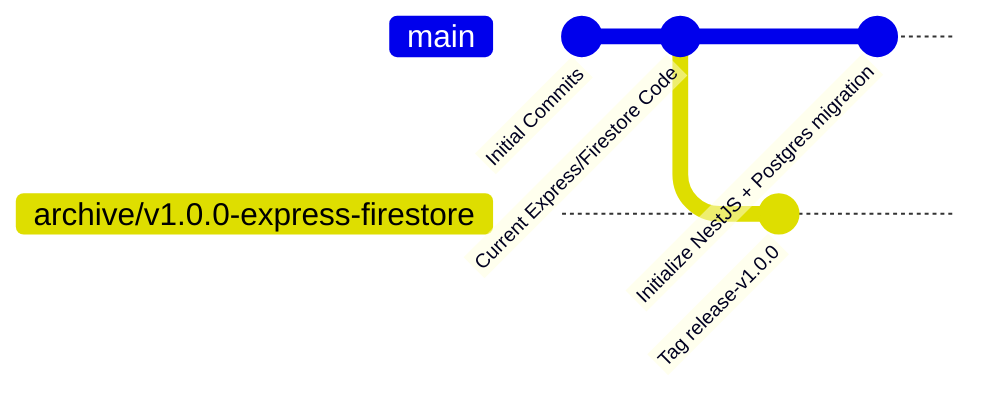

# AudioScape Git Branching & CI/CD Practices

This document outlines the Git branching workflow, environment promotion strategy, and CI/CD setup for AudioScape as the application transitions to its modernized architecture.

---

## 1. Initial Repository Reorganization

The current state of the repository contains the legacy Express/Firestore implementation on the `main` branch. Before introducing structural changes, we must archive this working version to a release branch to preserve it for rollback and reference.



### Steps to Archive the Current State:
1. Fetch the latest changes locally:
   ```bash
   git fetch origin
   git checkout main
   git pull origin main
   ```
2. Create and push a new tracking branch representing the current version:
   ```bash
   git checkout -b archive/v1.0.0-express-firestore
   git push -u origin archive/v1.0.0-express-firestore
   ```
3. Tag the release:
   ```bash
   git tag -a v1.0.0 -m "Release v1.0.0 - Stable Express + Firestore version"
   git push origin v1.0.0
   ```
4. Return to the `main` branch (which will serve as the target for integration):
   ```bash
   git checkout main
   ```

---

## 2. Branching Strategy

To maintain stability on staging and production environments, direct commits to `main` and `staging` are prohibited. All development must occur on task-specific branches.

```
       [Feature / Bugfix Branches]
       (feature/appshell, bugfix/jwt-auth, etc.)
                   │
                   ▼ (Pull Request + Review)
             [staging branch] (Autodeploys to staging environment)
                   │
                   ▼ (Tested & Approved Promotion PR)
              [main branch] (Autodeploys to production environment)
```

### Branch Naming Conventions:
- **Features:** `feature/short-description` (e.g., `feature/appshell-layout`, `feature/nestjs-auth`)
- **Bugfixes:** `bugfix/short-description` (e.g., `bugfix/recommendation-timestamp`, `bugfix/cors-origins`)
- **Hotfixes:** `hotfix/short-description` (direct patches to production, merged back to staging immediately)

---

## 3. Environment Promotion Flow

### Development Environment (Local)
* Developers run the stack locally.
* Connects to a local PostgreSQL instance or a dedicated Neon development branch database.
* Port mapping: Frontend on `http://localhost:5173`, Backend on `http://localhost:5000`.

### Staging Environment
* **Trigger:** Merges into the `staging` branch.
* **Hosting:**
  - Frontend: Vercel (linked to the `staging` branch, deploying to a staging domain like `staging.audioscape.app`).
  - Backend: Render (Web Service linked to `staging` branch, running always-on or on free-tier, connecting to the Staging Neon DB branch).
* **Purpose:** Integration testing, verification of NestJS boot up, database migration dry-runs, and client-ping warm-up testing.

### Production Environment
* **Trigger:** Merges from `staging` into `main`.
* **Hosting:**
  - Frontend: Vercel (linked to the `main` branch).
  - Backend: Render (Web Service linked to `main` branch).
* **Purpose:** Live user traffic.

---

## 4. Pull Request & Review Process

1. **Local Verification:**
   Before opening a PR, the developer must ensure:
   - The code compiles cleanly (`npm run build` passes on both frontend and backend).
   - No sensitive variables are committed (e.g., keys, real user UIDs like the one in `test.js`).
2. **Opening the Pull Request:**
   - Target branch: `staging`.
   - Include a clear description of the changed files, any migrations introduced, and manual testing steps.
3. **Merging to Staging:**
   - Squashed and merged to maintain a clean git history.
4. **Promotion to Production:**
   - Once a set of features is validated on the staging domain, open a PR from `staging` to `main`.
   - This PR acts as a release candidate. No code changes should be made here except for version tags or configuration overrides.

---

## 5. Branching & Tagging Guide (Explained with Analogies)

To keep release management intuitive, think of our branches and release tags as stages of building and launching a car model.

### 🚗 The Branching Metaphor

| Branch | Analogy | Role & Rule |
|---|---|---|
| **`feature/*` / `migration/*`** | **The Design Workbench & Lab** | Where individual parts (a new bumper, a database engine swap) are built and crafted. Work here is isolated. When a part is finished, submit a **Pull Request (PR)** to bring it to the Proving Ground. |
| **`staging`** | **The Test Track & Proving Ground** | Where all new parts are assembled together to run live tests, check for crashes, and ensure everything fits before public release. Deploys to a staging URL. |
| **`main`** | **The Showroom Floor (Production)** | The official car delivered to real users. Only 100% verified and tested code from `staging` gets promoted here via PR. **Direct commits are strictly forbidden.** |

---

### 🏷️ The Release Tagging Metaphor (Semantic Versioning)

Think of version tags as the **model release badge** stamped on the car:

```
    v MAJOR . MINOR . PATCH - PRE_RELEASE
       │       │       │         │
       │       │       │         └── Alpha/Beta milestone (Testing track)
       │       │       └──────────── Bug fixes (Brake pad adjustment)
       │       └──────────────────── New features (Adding a sunroof)
       └──────────────────────────── Complete engine rebuild / DB migration
```

#### 1. Pre-Release / Milestone Tags (`vX.Y.Z-alpha.N` or `vX.Y.Z-beta.N`)
* **Analogy:** **Prototype Test Run (Track Only)**
* **When to use:** When completing a major phase (like Phase 2 Postgres Migration) on `staging`, but the full major version (NestJS rewrite + deployment) isn't 100% done yet.
* **Example:**
  - Previous production baseline: `v1.0.2`
  - Completed Phase 2 DB Schema & Backfill on `staging`: **`v2.0.0-alpha.1`**
  - Completed Phase 3 NestJS Auth on `staging`: **`v2.0.0-alpha.2`**

#### 2. Major Release Tags (`v2.0.0`)
* **Analogy:** **Brand New Model Generation Launch**
* **When to use:** When promoting `staging` to `main` after completing the entire major architectural rewrite (Postgres + NestJS + Production Deployment).
* **Example:** Tag **`v2.0.0`** on `main`.

#### 3. Minor Release Tags (`v2.1.0`)
* **Analogy:** **Annual Facelift / New Trim Option**
* **When to use:** Adding a non-breaking new feature to `main` (e.g. YouTube Takeout taste bootstrap, new UI components).

#### 4. Patch Release Tags (`v2.0.1`)
* **Analogy:** **Quick Recall / Service Fix**
* **When to use:** Small bug fixes or hotfixes directly applied to production.

---

### 🛠️ Quick Command Checklist for Creating a Milestone Tag

When a PR is merged into `staging`:

```bash
# 1. Switch to staging branch & sync
git checkout staging
git pull origin staging

# 2. Tag your milestone preview
git tag -a v2.0.0-alpha.1 -m "Milestone: Phase 2 PostgreSQL migration and schema analysis fields"

# 3. Push tag to GitHub
git push origin v2.0.0-alpha.1
```
