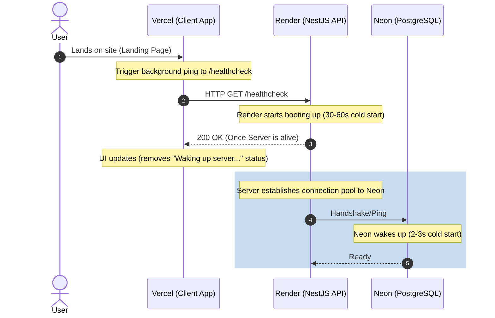

# AudioScape Modernization Roadmap

This document outlines the step-by-step roadmap to transition AudioScape from its current state (Express, Firestore, raw client YouTube calls, duplicated page shells) to a production-grade, highly resilient platform built on **NestJS**, **PostgreSQL (Neon)**, and a polished **React/Vite** frontend, hosted across **Vercel** and **Render** with optimized wake-up handling.

---

## Architecture Overview & Wake-up Flow

To optimize costs while ensuring a reliable user experience under serverless/idle conditions, the deployment follows a warm-up pipeline:

---

## Phase 1: Critical Fixes & Cleanup (Immediate)
*Goal: Secure the existing app, resolve mathematical errors in recommendations, and clean up the configuration aliases before starting the migration.*
* **Estimated Effort:** 2–3 Days

### Tasks
1. **Fix `recommendService.js` Timestamp Bug**
   - Correct the parameter order where `topN` was being passed as the `currentTimestamp` to the recommendation algorithm. Ensure `Date.now()` is passed as `currentTimestamp` and `topN` is passed as the final parameter.
2. **Secure the Recommendation and Cache Endpoints**
   - Add JWT token verification middleware to the Express endpoints `/api/music/recommend` and `/api/music/cache-related-tracks`.
   - Prevent unauthorized users from querying recommendations for arbitrary user IDs or poisoning the global recommendation keyword cache.
3. **Resolve YouTube API Key Client Exposure**
   - Remove the direct browser-level calls in `frontend/utils/youtube.js` using `VITE_YOUTUBE_API_KEY`.
   - Route the `ExplorePage.jsx` YouTube fetches through the backend (e.g., expanding `/youtube/search` or introducing a proxy handler) so the API key remains strictly server-side.
4. **Remove Unused/Duplicate Root Dependencies**
   - Prune the root `package.json` by removing backend-specific packages (`express`, `cors`, `express-rate-limit`, `python-shell`, `textarea`, `openai`, `@google/generative-ai` in favor of `@google/genai`).
5. **Standardize Path Aliases**
   - Reconfigure `vite.config.js`, `jsconfig.json`, and `components.json` so `@` consistently maps to the project root or a single unified directory (e.g., `./frontend/src` or `./utils`) to eliminate IDE vs. compiler resolution mismatches.

---

## Phase 2: PostgreSQL (Neon) Schema & Migration
*Goal: Model the database relations, set up Prisma, and backfill existing Firestore data to PostgreSQL.*
* **Estimated Effort:** 4–5 Days

### Tasks
1. **Database Provisioning**
   - Provision a PostgreSQL database on Neon.
   - Configure connection pooling and connection strings for development, staging, and production.
2. **Prisma Schema Setup**
   - Initialize Prisma in the project.
   - Define tables with explicit foreign keys, indexes, and unique constraints:
     - `users` (linked via `firebase_uid`)
     - `tracks` (using YouTube video ID as the primary key)
     - `listen_history` (composite unique index on `[user_id, track_id]`)
     - `playlists` and `playlist_tracks` (junction table replacing denormalized arrays)
     - `related_tracks_cache` (with server-side `expires_at` TTL column)
3. **Firestore to PostgreSQL Backfill Script**
   - Write a node script to fetch all data from Firestore (`users/*/music_history`, `users/*/playlists`, `relatedTracksCache`) and load it into PostgreSQL, ensuring data integrity.
4. **Dual-Write Architecture (Optional/Soak)**
   - Implement temporary dual-writing on the active backend to write to both Firestore and Postgres while reading exclusively from Firestore to verify schema compatibility.

---

## Phase 3: NestJS Backend Migration
*Goal: Rebuild the backend application with NestJS, securing all routes, structuring code modularly, and implementing native/OAuth authentication.*
* **Estimated Effort:** 7–9 Days

### Tasks
1. **NestJS Scaffolding**
   - Generate a new NestJS application with modules for:
     - `AuthModule` (Google OAuth & Native Email/Password signup)
     - `TracksModule` (YouTube search proxies, caching, category IDs)
     - `PlaylistsModule` (CRUD operations mapping to `playlist_tracks` table)
     - `RecommendationsModule` (TF-IDF similarity service via `natural`)
2. **Global Filters and Interceptors**
   - Implement a global `ExceptionFilter` for centralized error response structure and logging.
   - Implement validation pipes using `class-validator` (or Zod) to check input payloads on all POST/PUT routes.
3. **Authentication & Guards**
   - Define a `@UseGuards(FirebaseAuthGuard)` using passport-firebase to authenticate Bearer tokens on protected endpoints.
   - Add a native Email/Password credentials strategy (generating short-lived JWTs/session state) alongside Google OAuth identity validation.
4. **Migrate TF-IDF Recommendation Algorithm**
   - Port the recommendation logic from the pure JS implementation to a NestJS provider, feeding it query results from Prisma.

---

## Phase 4: Frontend UI Revamp & Cleanups
*Goal: Eliminate layout duplication, clean up components, and improve the user interface.*
* **Estimated Effort:** 5–7 Days

### Tasks
1. **Extract `AppShell` Layout Component**
   - Create a single layout component that houses the `<Sidebar />`, mobile drawer logic (`isSidebarOpen`), theme toggle, and `<TopNavbar />`.
   - Refactor `Home.jsx`, `ExplorePage.jsx`, `FavoritesPage.jsx`, and `PlaylistsPage.jsx` to wrap their unique content inside `<AppShell>`.
2. **Remove Dead Components & Stale Code**
   - Delete `MusicPlayer.jsx` (dead component referencing missing store actions).
   - Clean up `ProfilePage.jsx` to resolve Firestore-backed user stats and clean up raw `localStorage` fallback code.
3. **Polishing UX/UI**
   - Add micro-animations, loading skeletons, and glassmorphism styling to cards and scroll areas.
   - Standardize responsive states and add accessible `aria-label` tags to control elements.

---

## Phase 5: Deployment Flow & Wake-up Tuning
*Goal: Integrate the client ping mechanism, setup Render server cold-start handling, and configure Neon pool management.*
* **Estimated Effort:** 3–4 Days

### Tasks
1. **Client Background Ping Implementation**
   - Add a background `fetch` ping to the API server's `/healthcheck` endpoint inside the frontend's main boot sequence (e.g., in `App.jsx` or `main.jsx`).
   - Implement a user-facing visual feedback mechanism (e.g., a subtle header banner stating "Waking up server..." with a loading spinner) that disappears once the server returns `200 OK`.
2. **NestJS Connection Pool Resilience**
   - Configure Prisma connection pooling on Render to tolerate database connection timeouts gracefully during Neon database cold starts.
   - Ensure the server doesn't crash if Neon takes 2-3 seconds to respond on initial requests.
